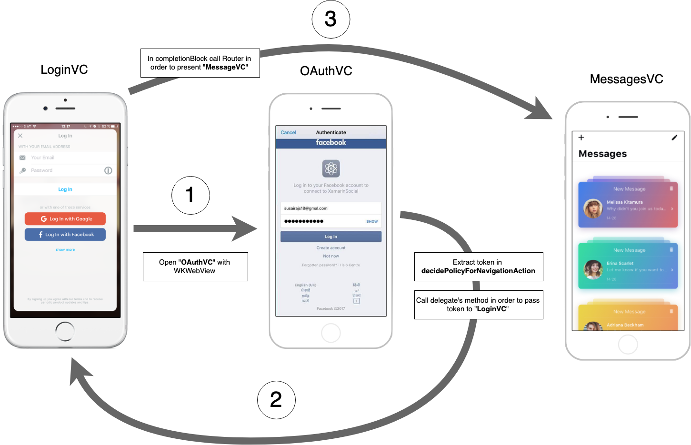

# vk-OAuth2_0

 Example of implementing **OAuth2.0** authentication for **vk.com**


### Graphical diagram of the authentication process





### Code example


### Code of the controller responsible for authentication


#### Token.h

```objectivec
/*--------------------------------------------------------------------------------------------------------------
 (🔑) 'Token' - class describing the token model
 --------------------------------------------------------------------------------------------------------------*/

@interface Token : NSObject <NSCoding,NSSecureCoding>

@property (nonatomic, strong) NSString* access_token;
@property (nonatomic, strong) NSString* userID;
@property (nonatomic, strong) NSString* expiresAfter; // inSeconds


/*--------------------------------------------------------------------------------------------------------------
 During initialization, the server sends us the number of seconds that the token will be valid.
 At the moment of initialization, we immediately create an 'expireDate' object that fixes the exact expiration date.
 --------------------------------------------------------------------------------------------------------------*/
@property (nonatomic, strong, readonly) NSDate* expireDate;


/*--------------------------------------------------------------------------------------------------------------
 Returns 'YES' if the current time is later than specified in 'expireDate'
 --------------------------------------------------------------------------------------------------------------*/
@property (nonatomic, assign, readonly) BOOL isExpire;


#pragma mark - Helpers

/*--------------------------------------------------------------------------------------------------------------
 Checks the received data from the server for validity
 --------------------------------------------------------------------------------------------------------------*/
- (nullable NSError*) checkDataCorrect;

#pragma mark - Initialization

+ (Token*) initWithAccessToken:(NSString*)token expiresAfter:(NSString*)expiresAfter userID:(NSString*)userID;

@end
```


#### Token.m

```objectivec
#import "Token.h"

@interface Token ()
@property (nonatomic, strong, readwrite) NSDate*  expireDate;
@end


@implementation Token

 #pragma mark - Validating data method

/*--------------------------------------------------------------------------------------------------------------
 Checks the received data from the server for validity
 --------------------------------------------------------------------------------------------------------------*/
- (nullable NSError*) checkDataCorrect
{
    NSMutableDictionary<NSString*,NSString*>* userInfo = [NSMutableDictionary new];
   
    if ((self.access_token.length < 1) || (!self.access_token)){
        userInfo[@"access_token"] = @"missing token";
    }

    if ((self.userID.length < 1) || (!self.userID)){
        userInfo[@"userID"] = @"missing userID";
    }
    
    if ((self.expiresAfter.length < 1) || (!self.expiresAfter)){
        userInfo[@"expiresAfter"] = @"missing expiresAfter";
    }
    
    if (userInfo.allKeys.count > 0){
        return  [NSError errorWithDomain:@"The instance was created from invalid data"
                                    code:0
                                userInfo:userInfo];
    }
    return nil;
}


 #pragma mark - Initialization

+ (Token*) initWithAccessToken:(NSString*)token expiresAfter:(NSString*)expiresAfter userID:(NSString*)userID
{
    Token* tokenObject = [[Token alloc] init];
    if (tokenObject) {
        tokenObject.access_token   = token;
        tokenObject.userID         = userID;
        tokenObject.expiresAfter   = expiresAfter;
        tokenObject.expireDate     = [[NSDate date] dateByAddingTimeInterval:[expiresAfter intValue]];
    }
    return tokenObject;
}

#pragma mark - Setters & Getters

/*--------------------------------------------------------------------------------------------------------------
 @property (nonatomic, assign, readonly) BOOL isExpire;
 --------------------------------------------------------------------------------------------------------------*/
- (BOOL)isExpire
{
    if (([self.expireDate timeIntervalSinceNow]<0) || (!self.expireDate)) {
        /* it's expired */
        return YES;
    }
    return NO;
}

/*--------------------------------------------------------------------------------------------------------------
 @property (nonatomic, strong) NSString* expiresAfter;
 --------------------------------------------------------------------------------------------------------------*/
- (void)setExpiresAfter:(NSString *)expiresAfter
{
    // If the value was already in the variable, then apparently we are updating the token for the second time and
    // therefore need to update the expiration date
    if (_expiresAfter){
        self.expireDate = [[NSDate date] dateByAddingTimeInterval:[expiresAfter intValue]];
    }
    _expiresAfter = expiresAfter;
}


#pragma mark - NSCoding

- (id)initWithCoder:(NSCoder *)decoder {
    self = [super init];
    if (!self) {
        return nil;
    }
    self.access_token = [decoder decodeObjectOfClass:[NSString class] forKey:@"access_token"];
    self.expiresAfter = [decoder decodeObjectOfClass:[NSString class] forKey:@"expiresAfter"];
    self.expireDate   = [decoder decodeObjectOfClass:[NSDate class] forKey:@"expireDate"];
    self.userID       = [decoder decodeObjectOfClass:[NSString class] forKey:@"user_id"];

    return self;
}

- (void)encodeWithCoder:(NSCoder *)encoder {
    [encoder encodeObject:self.access_token forKey:@"access_token"];
    [encoder encodeObject:self.expiresAfter forKey:@"expiresAfter"];
    [encoder encodeObject:self.expireDate   forKey:@"expireDate"];
    [encoder encodeObject:self.userID       forKey:@"user_id"];
}


+ (BOOL)supportsSecureCoding {
    return YES;
}

@end
```


#### AuthProtocol.h

```objectivec
@class Token;

/*--------------------------------------------------------------------------------------------------------------
 (📄) File 'Auth2_0_Delegate' - contains delegate methods used with OAuth 2.0 authentication.
 --------------------------------------------------------------------------------------------------------------*/

@protocol Auth2_0_Delegate <NSObject>

/*--------------------------------------------------------------------------------------------------------------
 'AuthViewController' calls this method from its delegate after the user has entered the correct username and password
 and the server screwed 'access_token'
 --------------------------------------------------------------------------------------------------------------*/
- (void) receivedToken:(nullable Token*)token error:(nullable NSError*)error;

/*--------------------------------------------------------------------------------------------------------------
 The method is created in case it is implemented by a class instead of an object
 --------------------------------------------------------------------------------------------------------------*/
+ (void) receivedToken:(nullable Token*)token error:(nullable NSError*)error;

@end
```


#### AuthViewController.h

```objectivec
/*--------------------------------------------------------------------------------------------------------------
 (🌐📱) 'AuthViewController' - shows 'WKWebView' with a pre-set address for user authorization.
 --------------------------------------------------------------------------------------------------------------*/

@interface AuthViewController : UIViewController

// After receiving the token it will be returned to the delegate via its method
@property (nonatomic, weak) id<Auth2_0_Delegate> delegate;

#pragma mark - Initialization

+ (AuthViewController*) initWithDelegate:(id<Auth2_0_Delegate>) delegate;

@end
```

#### AuthViewController.m

```objectivec
#import "AuthViewController.h"
// Native WebView
#import <WebKit/WebKit.h>
// Own APIManager
#import "APIManager.h"
// Own token
#import "Token.h"
// Own Router
#import "Router.h"

// Address for user authorization
#define callBackScheme @"https://oauth.vk.com/blank.html"

@interface AuthViewController () <WKNavigationDelegate>
@property (nonatomic, strong) NSString* clientId;
@property (nonatomic, strong) WKWebView *webView;
@end


@implementation AuthViewController


#pragma mark - Life cycle

/*--------------------------------------------------------------------------------------------------------------
 Configures the request for authorization and sends it to 'WKWebView' for execution
 --------------------------------------------------------------------------------------------------------------*/
- (void)viewDidLoad {
    [super viewDidLoad];

    NSURLRequest* request = [self authenticationRequest];
    if (request){
        [self.webView loadRequest:request];
         self.webView.navigationDelegate = self;
    }
}

/*--------------------------------------------------------------------------------------------------------------
 Inside the method, an internal method is called that configures all UI elements
 --------------------------------------------------------------------------------------------------------------*/
- (void)viewDidAppear:(BOOL)animated
{
    [super viewDidAppear:animated];
    // (⚠️) Please call the '-setupViews' method in 'viewDidAppear' because the decision to add a navigationBar
    // is made after the algorithm whether self.presentingViewController is nil or not. The value of this property
    // is set approximately during the call to 'viewDidAppear'
    [self setupViews];
}


#pragma mark - Logic

/*--------------------------------------------------------------------------------------------------------------
  The request will enter the authorization page
 --------------------------------------------------------------------------------------------------------------*/
- (NSURLRequest*) authenticationRequest
{
    NSURLComponents* urlComponents = [[NSURLComponents alloc] initWithString:@"https://oauth.vk.com/authorize"];
    urlComponents.queryItems = @[[NSURLQueryItem queryItemWithName:@"client_id"    value:self.clientId],
                                 [NSURLQueryItem queryItemWithName:@"redirect_uri" value:@"https://oauth.vk.com/blank.html"],
                                 [NSURLQueryItem queryItemWithName:@"display"      value:@"page"],
                                 [NSURLQueryItem queryItemWithName:@"scope"        value:@"6"],
                                 [NSURLQueryItem queryItemWithName:@"response_type"value:@"token"],
                                 [NSURLQueryItem queryItemWithName:@"v"            value:@"5.52"]];
    
    return [NSURLRequest requestWithURL:urlComponents.URL];
}


#pragma mark - Action

/*--------------------------------------------------------------------------------------------------------------
  Hides the controller by pressing the 'cancel' button
 --------------------------------------------------------------------------------------------------------------*/
- (void) cancelBtnAction:(UIBarButtonItem*)btn
{
    [self dismissViewControllerAnimated:YES completion:nil];
}


#pragma mark - WKNavigationDelegate

/*--------------------------------------------------------------------------------------------------------------
  The main method used for OAuth2. 0 authentication.
  Initially called upon execution of the very first request of 'authenticationRequest',
  then it can make several more redirects after the user enters the password and login,
  in case of entering valid data, the method provides a url in which there is a token.
 --------------------------------------------------------------------------------------------------------------*/

- (void)webView:(WKWebView *)webView decidePolicyForNavigationAction:(WKNavigationAction *)navigationAction decisionHandler:(void (^)(WKNavigationActionPolicy))decisionHandler
{    
    NSURL* url = navigationAction.request.URL;
    
    // The method was called three times, and these are the URLs that made the requests
    
    // 1. https://oauth.vk.com/authorize?client_id=753197&redirect_uri=https://oauth.vk.com/blank.html&display=page&scope=6&response_type=token&v=5.52
    // 2. https://oauth.vk.com/authorize?client_id=753197&redirect_uri=https%3A%2F%2Foauth.vk.com%2Fblank.html&response_type=token&scope=6&v=5.52&state=&display=page&__q_hash=7dcc3a88977871b061278530ea45a1a5
    // 3. https://oauth.vk.com/blank.html#access_token=aebe9cb9bb35272e172085c8559c6059c9c9316d90e57f768db507fd50ea139608f162c6baabf&expires_in=86400&user_id=1
    
    // Checking whether we were redirected by 'redirect_uri'
    if ([url.host isEqualToString:@"oauth.vk.com"] && [url.path hasPrefix:@"/blank.html"])
    {
        NSDictionary *urlParams = [AuthViewController queryParametersFromURL:url];
        NSLog(@"urlParams: %@",urlParams);

        // Processing a positive response
        if ([url.fragment hasPrefix:@"access_token"])
        {
           // queryStringDictionary: {
           //     "access_token" = f6cef9a2463250a1b5f5d308e762f2082ec74c714efff0af70373be7b60e0ba6a53e9;
           //     "expires_in" = 86400;
           //     "user_id" = 1;
           // }
            Token* token = [Token initWithAccessToken:urlParams[@"access_token"] expiresAfter:urlParams[@"expires_in"] userID:urlParams[@"user_id"]];
            NSError* correctTokenError = [token checkDataCorrect];
            __weak typeof(self) weak = self;
            [self dismissViewControllerAnimated:YES completion:^{
                [weak.delegate receivedToken:token error:correctTokenError];
            }];
        }
        
        // Processing a negative response
        if ([url.fragment hasPrefix:@"error=access_denied"])
        {
            // http://REDIRECT_URI#error=access_denied&error_description=The+user+or+authorization+server+denied+the+request.
            // {  "error" = "access_denied";
            //    "error_description" = "The+user+or+authorization+server+denied+the+request";
            //  }
            
            if (urlParams[@"error"] && urlParams[@"error_description"])
            {
                NSDictionary* userInfo = @{@"error_description" : urlParams[@"error_description"]};
                NSError* error = [NSError errorWithDomain:urlParams[@"error"] code:0 userInfo:userInfo];
                [self.delegate receivedToken:nil error:error];
                [self dismissViewControllerAnimated:YES completion:nil];
            }
        }
    }
    decisionHandler(WKNavigationActionPolicyAllow);
}

/*--------------------------------------------------------------------------------------------------------------
  The auxiliary method creates a dictionary from parameters passed in the url
 --------------------------------------------------------------------------------------------------------------*/
+(NSDictionary<NSString *, NSString *> *)queryParametersFromURL:(NSURL *)url {
   
    NSMutableDictionary *queryStringDictionary = [[NSMutableDictionary alloc] init];
    NSArray *urlComponents;
    
    // There may not always be a 'fragment', so we will take the entire url in case it is missing
    if (url.fragment) {
        urlComponents = [url.fragment componentsSeparatedByString:@"&"];
    } else {
        urlComponents = [url.absoluteString componentsSeparatedByString:@"&"];
    }
    
    for (NSString *keyValuePair in urlComponents)
    {
        // Looking for the first ' = ' sign in the assumed string 'access_token=943a4e8867e20cba33c67cb9ba900482d5099383079e3cb9c2db8a7a7b0e9'
        NSRange rangeOfFirstEqualSign = [keyValuePair rangeOfString:@"="];
        if (rangeOfFirstEqualSign.location == NSNotFound){
            continue;
        }
        NSString *key   = [[keyValuePair substringToIndex:rangeOfFirstEqualSign.location] stringByRemovingPercentEncoding];
        NSString *value = [[keyValuePair substringFromIndex:rangeOfFirstEqualSign.location+1] stringByRemovingPercentEncoding];
        [queryStringDictionary setObject:value forKey:key];
    }
    return queryStringDictionary;
}


#pragma mark - UI Settuping

/*--------------------------------------------------------------------------------------------------------------
 Creates, customizes, adds UI elements before using the controller
 --------------------------------------------------------------------------------------------------------------*/
- (void) setupViews
{
    //==================================== Setup UINavigationBar ========================================//
    
    CGFloat statusBarHeight = [[UIApplication sharedApplication] statusBarFrame].size.height;
    
    UINavigationBar *navBar = [[UINavigationBar alloc] initWithFrame:CGRectMake(0, statusBarHeight, [[UIScreen mainScreen] bounds].size.width, 44)];
    navBar.backgroundColor = [UIColor whiteColor];
    
    UINavigationItem *navItem = [[UINavigationItem alloc] init];
    navItem.title = @"Sign In";
    
    UIBarButtonItem* cancelBtn = [[UIBarButtonItem alloc] initWithBarButtonSystemItem:UIBarButtonSystemItemCancel target:self action:@selector(cancelBtnAction:)];
    navItem.leftBarButtonItem = cancelBtn;
    
    navBar.items = @[navItem];
    
    if (self.presentingViewController){
        [self.view addSubview:navBar];
    }
    //==================================== Setup WebView ========================================//
   
    self.view.backgroundColor = [UIColor colorWithRed: 0.98 green: 0.98 blue: 0.98 alpha: 1.00];
    self.webView.translatesAutoresizingMaskIntoConstraints = NO;

    NSLayoutConstraint *top =
    [NSLayoutConstraint constraintWithItem: self.webView
                                 attribute: NSLayoutAttributeTop
                                 relatedBy: NSLayoutRelationEqual
                                    toItem: self.view
                                 attribute: NSLayoutAttributeTop
                                multiplier: 1
                                  constant: (self.presentingViewController) ? CGRectGetMaxY(navBar.frame) : statusBarHeight];
    
    NSLayoutConstraint *bottom =
    [NSLayoutConstraint constraintWithItem: self.webView
                                 attribute: NSLayoutAttributeBottom
                                 relatedBy: NSLayoutRelationEqual
                                    toItem: self.view
                                 attribute: NSLayoutAttributeBottom
                                multiplier: 1
                                  constant: 0];
    
    
    NSLayoutConstraint *leading =
    [NSLayoutConstraint constraintWithItem: self.webView
                                 attribute: NSLayoutAttributeLeading
                                 relatedBy: NSLayoutRelationEqual
                                    toItem: self.view
                                 attribute: NSLayoutAttributeLeading
                                multiplier: 1
                                  constant: 0];
    
    NSLayoutConstraint *traling =
    [NSLayoutConstraint constraintWithItem: self.webView
                                 attribute: NSLayoutAttributeTrailing
                                 relatedBy: NSLayoutRelationEqual
                                    toItem: self.view
                                 attribute: NSLayoutAttributeTrailing
                                multiplier: 1
                                  constant: 0];

    //==================================== Add subviews to super view ========================================//

    [self.view addSubview:self.webView];
    [self.view addConstraints:@[top,bottom,leading,traling]];
}


#pragma mark - Getters

- (WKWebView*)webView
{
    if (!_webView){
         _webView = [[WKWebView alloc] init];
    }
    return _webView;
}

- (NSString *)clientId
{
    if (!_clientId){
        // id of the vk app itself, you can get it here: https://vk.com/apps?act=manage
         _clientId = @"753197";
    }
    return _clientId;
}


#pragma mark - Initialization

/*--------------------------------------------------------------------------------------------------------------
 A prerequisite for initializing the controller is the transfer of the delegate to which the token will be returned
 --------------------------------------------------------------------------------------------------------------*/
+ (AuthViewController*) initWithDelegate:(id<Auth2_0_Delegate>) delegate
{
    AuthViewController* vc = [[AuthViewController alloc] init];
    if (delegate) {
        vc.delegate = delegate;
    }
    return vc;
}

@end
```
